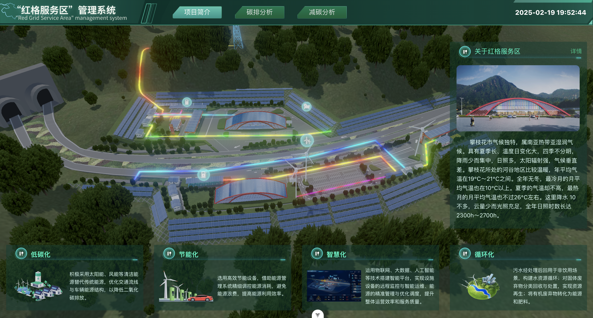
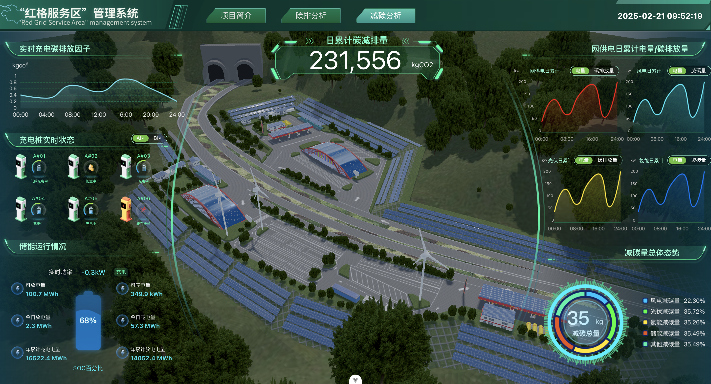
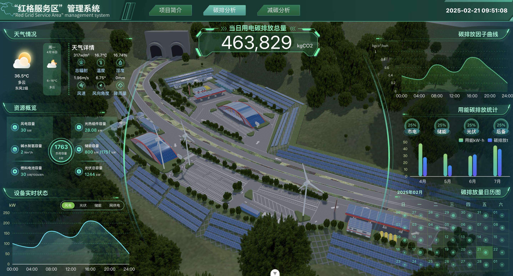

# hongge-service-zone

零碳服务区三维可视化展示系统

## 项目简介

本项目是一个基于 Vue 3 开发的零碳服务区三维可视化展示系统。通过该系统可以直观地展示服务区的碳排放和减碳分析数据。

### 主要功能

- 项目概况展示
- 碳排放分析
- 减碳分析
- 实时数据更新
- 3D 可视化展示

### 技术栈

- Vue 3
- Element Plus
- Three.js
- Autofit.js
- Day.js

## 项目预览





## 快速开始

### 安装依赖

```sh
pnpm install
```

### 启动开发服务器

```sh
pnpm serve
```

## 项目结构

```
src/
├── assets/         # 静态资源
├── components/     # 公共组件
├── views/         # 页面组件
│   ├── project-profile/    # 项目简介
│   ├── carbon-emission/    # 碳排放分析
│   └── carbon-reduction/   # 减碳分析
└── App.vue        # 根组件
```

## 开发说明

- 项目使用 autofit.js 实现屏幕自适应，默认设计尺寸为 1440x780
- 使用 Element Plus 组件库构建界面
- 实时时间显示使用 Day.js 处理
- 3D 场景更新使用 requestAnimationFrame 实现流畅渲染

```sh
pnpm install

pnpm serve
```
